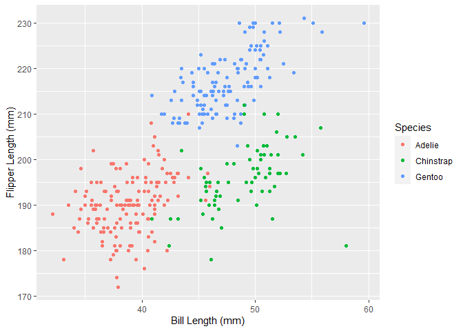

Homework 1
================
Lily Wang
9/14/2020

This is my solution to HW1.

``` r
library(tidyverse)
```

    ## -- Attaching packages ------------------------------- tidyverse 1.3.0 --

    ## v ggplot2 3.3.2     v purrr   0.3.4
    ## v tibble  3.0.3     v dplyr   1.0.2
    ## v tidyr   1.1.2     v stringr 1.4.0
    ## v readr   1.3.1     v forcats 0.5.0

    ## -- Conflicts ---------------------------------- tidyverse_conflicts() --
    ## x dplyr::filter() masks stats::filter()
    ## x dplyr::lag()    masks stats::lag()

## Problem 1

First part of Problem 1, creating a data frame with the required
elements:

``` r
prob1_df <- tibble(
  vec_numeric = rnorm(10),
  vec_gt_0 = vec_numeric > 0,
  vec_character = c("q","w","e","r","t","y","u","i","o","p"),
  vec_factor = factor(c("low","high","mod","high","mod","mod","low","mod","low","high"))
)
prob1_df
```

    ## # A tibble: 10 x 4
    ##    vec_numeric vec_gt_0 vec_character vec_factor
    ##          <dbl> <lgl>    <chr>         <fct>     
    ##  1      0.843  TRUE     q             low       
    ##  2     -0.0482 FALSE    w             high      
    ##  3      0.0460 TRUE     e             mod       
    ##  4     -0.748  FALSE    r             high      
    ##  5      2.42   TRUE     t             mod       
    ##  6     -1.23   FALSE    y             mod       
    ##  7      0.715  TRUE     u             low       
    ##  8     -0.679  FALSE    i             mod       
    ##  9     -1.48   FALSE    o             low       
    ## 10      0.986  TRUE     p             high

Take the mean of each variable from my dataframe.

``` r
mean(pull(prob1_df, vec_numeric))
```

    ## [1] 0.08275554

``` r
mean(pull(prob1_df, vec_gt_0))
```

    ## [1] 0.5

``` r
mean(pull(prob1_df, vec_character))
```

    ## Warning in mean.default(pull(prob1_df, vec_character)): argument is not numeric
    ## or logical: returning NA

    ## [1] NA

``` r
mean(pull(prob1_df, vec_factor))
```

    ## Warning in mean.default(pull(prob1_df, vec_factor)): argument is not numeric or
    ## logical: returning NA

    ## [1] NA

As seen from the warning messages, only taking the mean of the numeric
and logical vectors work.

Now, I will convert the logical, character, and factor vectors into
numeric without showing the results:

    ##  [1] 1 0 1 0 1 0 1 0 0 1

    ## Warning: NAs introduced by coercion

    ##  [1] NA NA NA NA NA NA NA NA NA NA

    ##  [1] 2 1 3 1 3 3 2 3 2 1

The character vector could not be coerced into numeric, but the factor
vector could, which does not explain what happens when I tried to take
the mean as the mean could not be calculated for the factors.

Now I will convert and multiply by the random sample as directed:

``` r
as.numeric(pull(prob1_df, vec_gt_0)) * pull(prob1_df, vec_numeric)
```

    ##  [1] 0.84306637 0.00000000 0.04595942 0.00000000 2.41947582 0.00000000
    ##  [7] 0.71477983 0.00000000 0.00000000 0.98627327

``` r
as.factor(pull(prob1_df, vec_gt_0)) * pull(prob1_df, vec_numeric)
```

    ## Warning in Ops.factor(as.factor(pull(prob1_df, vec_gt_0)), pull(prob1_df, : '*'
    ## not meaningful for factors

    ##  [1] NA NA NA NA NA NA NA NA NA NA

``` r
as.numeric(as.factor(pull(prob1_df, vec_gt_0))) * pull(prob1_df, vec_numeric)
```

    ##  [1]  1.68613273 -0.04820755  0.09191884 -0.74754565  4.83895164 -1.23064939
    ##  [7]  1.42955967 -0.67875477 -1.47684193  1.97254654

## Problem 2

Load the **penguins** dataset:

``` r
data("penguins", package = "palmerpenguins")
```

The **penguins** dataset is 344 rows by 8 columns and contains
information for the following: **species, island, bill\_length\_mm,
bill\_depth\_mm, flipper\_length\_mm, body\_mass\_g, sex, year**.

**species**: Categorical. Species of penguins studied. Possible values
are: Adelie, Gentoo, Chinstrap.  
**island**: Categorical. Island where data were acquired from. Possible
values are: Torgersen, Biscoe, Dream.  
**bill\_length\_mm**: Double. Length of the penguin’s bill in
millimeters.  
**bill\_depth\_mm**: Double. Depth of the penguin’s bill in
millimeters.  
**flipper\_length\_mm**: Integer. Length of the penguin’s flipper in
millimeters.  
**body\_mass\_g**: Integer. Penguin’s body mass in grams.  
**sex**: Categorical. Penguin’s sex. Possible values are: male,
female.  
**year**: Integer. Year in which the data were collected.

The mean flipper length is 200.92 mm.

Scatter plot of **flipper length vs bill length by species**:

``` r
ggplot(penguins, aes(x = bill_length_mm, y = flipper_length_mm, color = species)) + geom_point()
```

    ## Warning: Removed 2 rows containing missing values (geom_point).

<!-- -->

``` r
ggsave("bill_lengthVSflipper_length_plot.pdf", height = 4, width = 6)
```

    ## Warning: Removed 2 rows containing missing values (geom_point).
